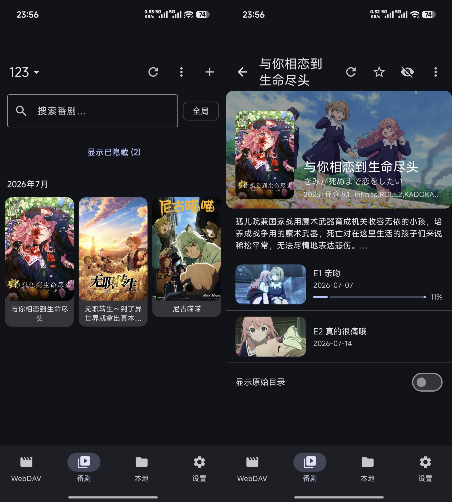

# UnU-Player

<div align="center">
  
</div>

一款以个人需求为基准的面向二次元内容的本地视频播放器，基于 [libmpv]内核，使用 Kotlin + Compose Multiplatform 开发。支持 Android 与 Windows x64。主要针对webdav及本地的刮削后的二次元番剧内容解析以及生成海报墙播放。支持安卓端HDR播放以及无拷回硬件解码。

## 功能

- **播放源**：WebDAV 服务器、本地文件（Android SAF / Windows 文件系统）
- **播放**：基于 mpv，软解 / 硬件解码（copy-back）、HDR 处理、倍速、音轨 / 字幕轨选择
- **弹幕**：弹弹 play 自动 / 手动匹配，多渲染内核（默认 Atlas 批渲染）
- **字幕**：内封轨、同目录外挂字幕自动 / 手动加载、字体与样式设置
- **海报墙**：WebDAV / 本地库扫描刮削、搜索、收藏、屏蔽
- **播放记录**：续播、历史记录

## 下载

预编译版本见 [Releases](https://github.com/weiyongzenqi/UnU-Player/releases)：

- Android：`androidApp-release.apk`（arm64-v8a）
- Windows：`UnU-Player-Setup-x64.exe`（Inno Setup 安装包）

## 构建

从源码构建请阅读 [BUILD.md](BUILD.md)（含 Android libmpv AAR 的编译与 Windows libmpv dll 的获取方式）。

## 开发主线
当前主要精力在安卓端，桌面端有雏形但是问题较多。

## 使用建议
使用[Ani-RSS项目](https://github.com/wushuo894/ani-rss) 进行内容的下载并刮削，需确保有twshow.nfo文件，以此解析后可展示海报墙，须确保目录结构为刮削格式。

## 许可证

本项目**源代码**以 [GNU General Public License v3](LICENSE)（GPLv3）许可发布。

```
Copyright (C) 2026  weiyongzenqi
```

- UnU-Player 的原创源代码遵循 GPLv3（或更高版本）。
- 二进制发行版包含基于 GPL 的组件（mpv、FFmpeg），组合作品整体同样受 GPLv3 约束；为方便用户使用而提供，并随程序附带本许可证副本与对应源码获取方式。
- 项目直接引用的第三方库（Kotlin、Compose 等）保有各自的开源许可证，清单见应用「设置 → 关于 → 依赖与致谢」。

## 文档

- [构建说明（BUILD.md）](BUILD.md)

## 感谢
部分弹幕前期设计有参考[NipaPlay](https://github.com/AimesSoft/NipaPlay-Reload)